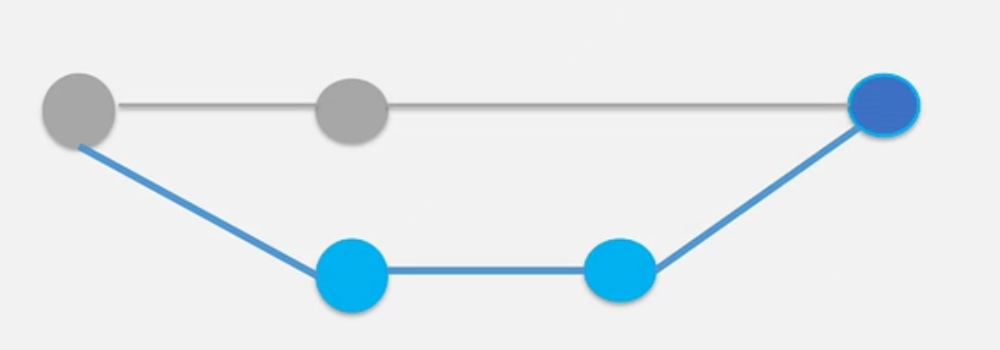
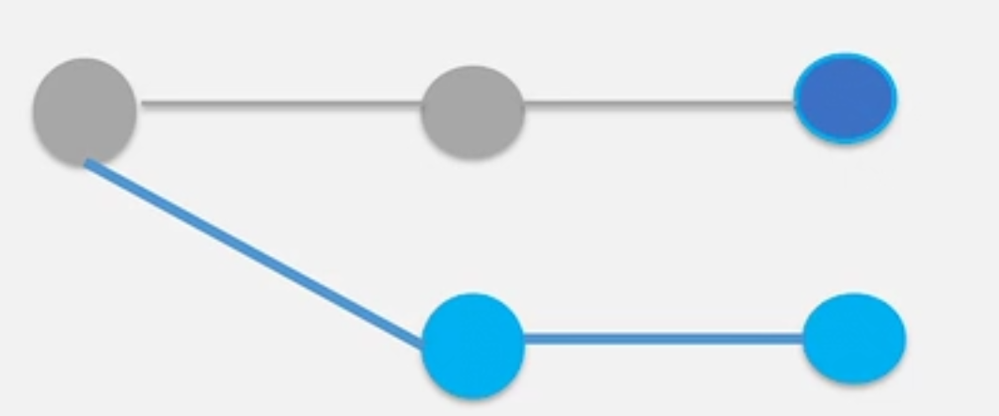
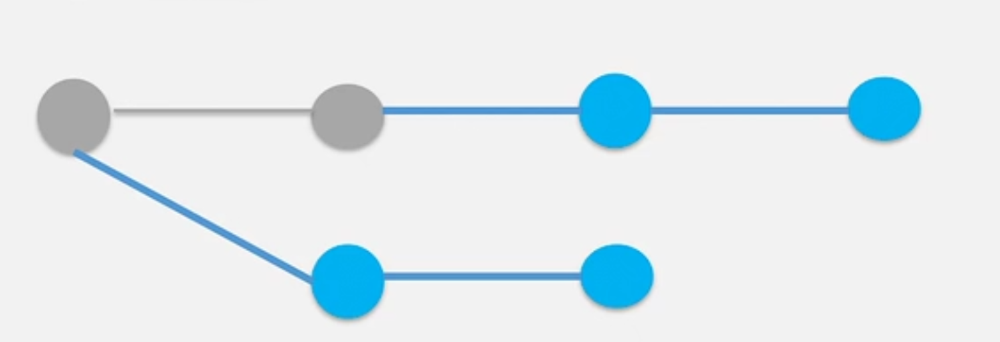
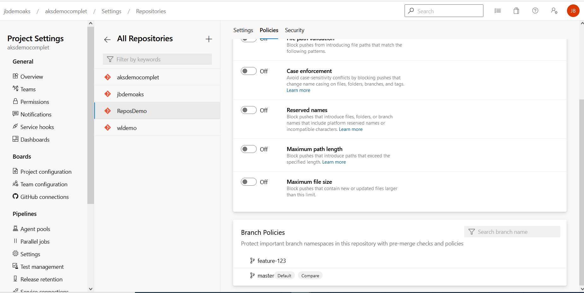
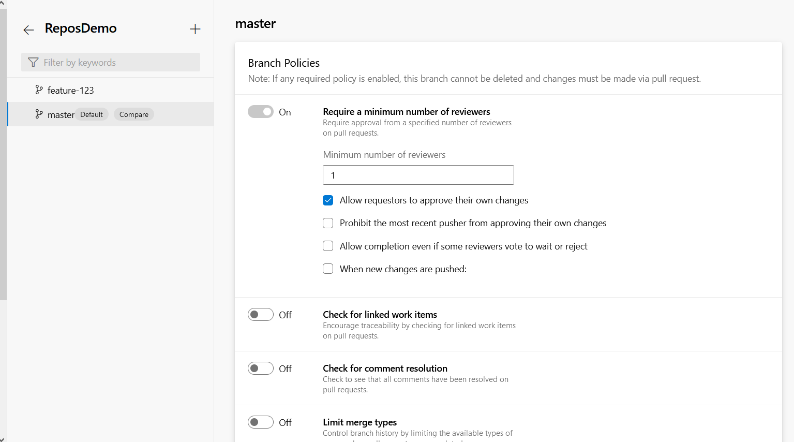

# What are Pull requests in Git

- made changes to a particular branch in local reposity and now want to merge changes onto the main branch in Azure Repos.

- ensure the changes are reviewed before merge in the Azure Repos to prevent code issue

- need to place a restriction on the main branch in Azure Devops to initiate a pull request before merge

- The pull request can be reviewed by a lead Tech

- The lead tech can check what are the changes that are going to be made

- if the changes are approved, the pull request can be approved

- can protect branches with branch policies

# different types of merges

- Merge (no fast-forward) - Here all the individual commits in the pull request branch are preserved as is.
A new merge commit is created which unites the master branch and the pull request branch.



- Squash commit - here the resulting commit is not exactly a merge commit. Here it just maintains a simple, straight, linear history



- Rebase - will take each individual commit in the pull request and cherry-pick them into the master branch



# example :

```console
# on voit nos 2 branches et lhistorique, le plus recent en haut
C:\FormationAzureDevOps\AzureRepos\files>git log
commit d7f2620a534804c7cb03f3edc587f72c85150f8f (HEAD -> feature-123, origin/feature-123)
Author: julien barbaro <jbarbaro@groupeisagri.com>
Date:   Wed Jun 9 11:12:38 2021 +0200

    Feature commit

commit d4c578f945f6468b0e4c407952538e4ffc188759 (origin/master, master)
Author: julien barbaro <jbarbaro@groupeisagri.com>
Date:   Wed Jun 9 10:22:56 2021 +0200

    second change

commit dffc0033ac4da024d2dc022cd5f3896468b31c3f
Author: jabberwokks41 <julien.barbaro@gmail.com>
Date:   Wed Jun 9 09:52:14 2021 +0200

    Initial Commit

# verification de la branche ou on travaille
C:\FormationAzureDevOps\AzureRepos\files>git branch
* feature-123
  master

# changement de branche de travail
C:\FormationAzureDevOps\AzureRepos\files>git checkout master
Switched to branch 'master'
Your branch is up to date with 'origin/master'.

# merge locally
C:\FormationAzureDevOps\AzureRepos\files>git merge feature-123
Updating d4c578f..d7f2620
Fast-forward
 sample.txt | 2 +-
 1 file changed, 1 insertion(+), 1 deletion(-)

C:\FormationAzureDevOps\AzureRepos\files>more sample.txt
This is the feature branch

```

# branch policy Azure DevOps



