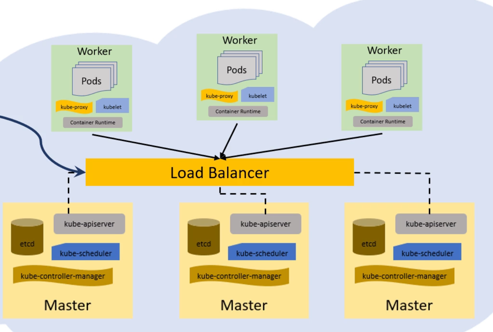

# Need for Highly-Available Cluster

  what happens if the master itself goes down or crashes?

  Remove single point of failure from the cluster

# Best practices

  Do not use cluster with two master replicas
  Need to run a minimum of three control plane nodes for an HA cluster
  Load-Balancer to distribute traffic to all healthy control plane nodes
  Place master replicas in different zones

Stacked control plane nodes (with co-located etcd nodes)

External etcd nodes (etcd runs on separate nodes)

