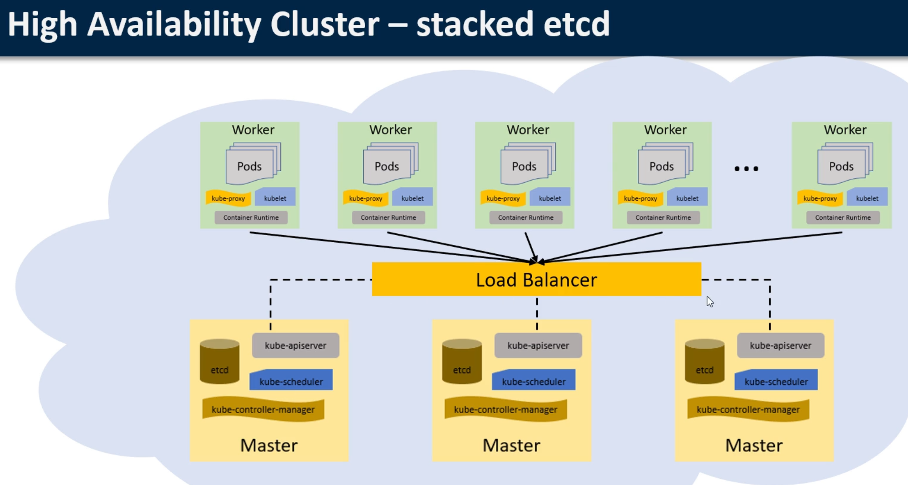
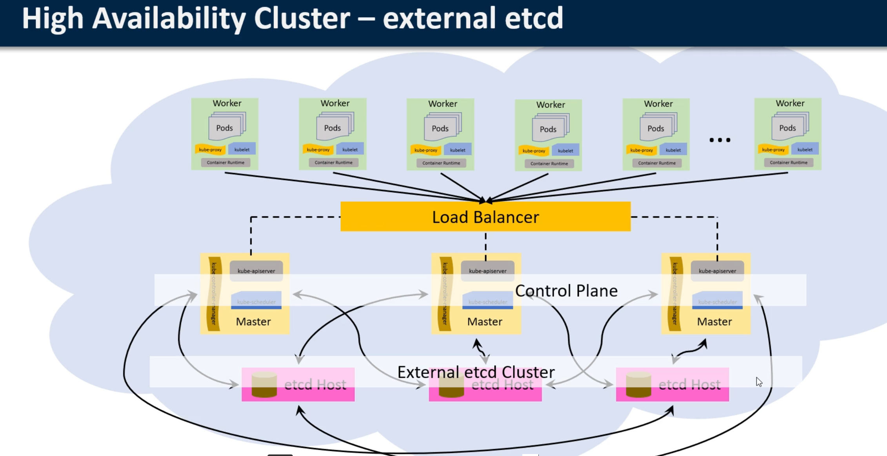

# design a kubernetes cluster :

application components and the number of replicas

kubernetes v1.16 has the following restrictions

- 5000 nodes
- 150 000 pods
- 300 000 containers
- 100 pods per node

https://kubernetes.io/docs/setup/best-practices/cluster-large/

# size of master and master components

1-5 nodes : 2vCPU / 4 GB RAM
6-10 nodes : 2vCPU / 7.5 GB RAM
11-100 nodes : 4vCPU / 15 GB RAM
101-250 nodes : 8vCPU / 30 GB RAM
251-500 nodes : 16vCPU / 30 GB RAM
+ 500 nodes : 36vCPU / 60 GB RAM

# etcd external or co-located

etcd is the key-value store fore the entire cluster
it can be a single etcd server or it can be a cluster of etcd nodes

# high Availabilit Cluster

No single point of failure

kube-apiserver is exposed to worker nodes using a load balancer
_
two way of configuring the HA cluster - stacked or external etcd

## High Availability Cluster - stacked etcd

minimum 3 master node 

## High Availability Cluster - external etcd 

minimum 3 master node and 3 etcd nodes

# Cluster Monitoring

need to understand how the applications behaves when it's deployed
resource metrics or full metrics pipelines to collect monitoring statistics
metrics are collected by the lightweight, short-term, in-memory metrics-server which discovers all dnodes on the cluster and queries each node's kubelet for CPU and memory usage

# infrastructure

on-premises based or hosted in the cloud ?
bare metal hardware or on virtual machines 
using a hosted Kubernetes cluster or hosting your own cluster?
Federation for managing multiple cluser

# Security

Security at all the four layers of Code, Container, Cluster and Network
Type of accesss identity provider for authentication, Firewall Rules, forwarding rules, Routes, Target pools, etc