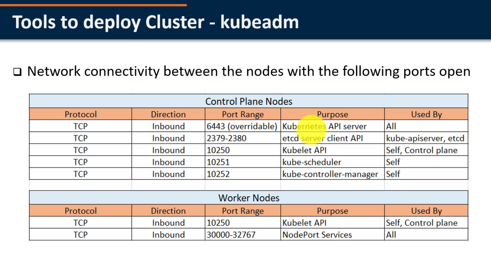

installing k8s with deployement tools

Turnkey Cloud Solutions

to run containers in Pods, kubernetes uses a container runtime
Docker, CRI-O or Containerd 

# kubeadm 
following operating systems are supported with v1.16

ubuntu 16.04+
debian 9+
CentOS 7
Red Hat Entreprise Linux (RHEL) 7
Fedora 25+
HypriotOS v1.01+ (Debian-based OS optimized to run Docker)
Container Linux

2CPU 2GB of ram mini

control plan nodes

kubeadm will automatically detect the container runtime by scanning through a list of domain sockets

Docker /var/run/docker.sock
containerd /run/containerd/containerd.sock
CRI-O /var/run/crio/crio.sock

can be used to configure a single node cluster or a multi-node cluster with single Master or 
in HA config (stacked /external etcd)

# kops

used to create, destroy, upgrade and maintain production-grade, highly available, Kubernetes clusters from the command line

Currently only AWS is officially supported
GCE and OpenStack in beta support
VMware vShere in alpha support

# krib

kubernetes rebar integrated bootstrap is used for installing cluster on bare-metal servers 

it works in conjunction with Digital Rebar Provision (DRP) - integrated Golang DHCP, bare metal provisioning (PXE/iPXE) and workflow automation platform

# kubespray

GCE, Azure, OpenStack, AWS, VMware vSphere or Barmetal servers

composition of Ansible playboos, inventory files and provisioning tools

# Turnkey Solutions

Alibaba cloud
AWS EC2
Microsoft Azure
Century Link Cloud
Google Cloud PlatForm
IBM Cloud Private
Tencent Cloud